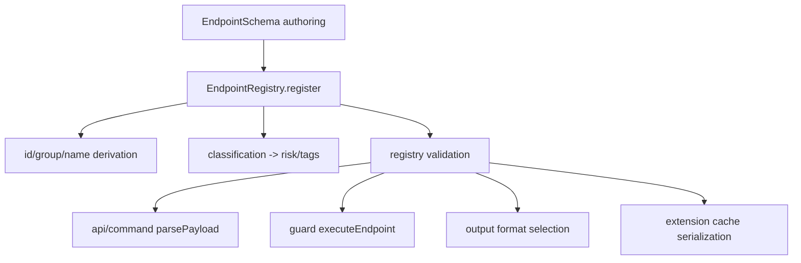

# EndpointSchema

## Overview

`EndpointSchema` is the authored contract for `siyuan api` endpoints. It is not a bag of optional fields. Several fields are coupled and drive runtime behavior across five stages:

1. registry identity derivation,
2. risk and tag derivation,
3. CLI argument parsing,
4. permission guard execution,
5. compact output rendering and cache serialization.

This spec defines the stable rules that built-in endpoints and API extensions must both satisfy.

## Architecture



## Components

| Component | File | Responsibility |
|---|---|---|
| Type contract | `/src/shared/schema.ts` | Defines `EndpointSchema`, `EndpointClassification`, `FilterSpec`, `CliBehavior`, pointer-path helpers |
| Registry | `/src/api/registry.ts` | Derives endpoint identity and meta; enforces registry-level schema rules |
| CLI payload parser | `/src/shared/argv.ts` | Maps argv/json/file/positional input into `payload` using schema CLI metadata |
| Runtime guard | `/src/api/guard.ts` | Applies endpoint-level permission checks, payload guards, approval, response filtering |
| Output renderer | `/src/shared/output.ts` | Executes `format`/`formatStrategy` compact rendering |
| Extension cache | `/src/extension/cache.ts` | Serializes only cache-safe schema metadata |

## Specification

### 1. Identity is derived from `endpoint`

`endpoint` is the only authoritative identity field.

```ts
endpoint: "/api/query/sql"
```

The registry derives:

```ts
id = "query.sql"
group = "query"
name = "sql"
```

Rules:
- `endpoint` MUST match `/api/<group>/<name>`.
- Authors MUST NOT invent a second identity field for endpoints.
- Built-in and extension endpoints share the same identity derivation logic.

Code refs: `/src/shared/schema.ts#deriveEndpointId`, `/src/api/registry.ts#register`, `/src/api/registry.ts#registerExtension`.

### 2. `classification` is authored truth

`classification` is the semantic source of truth for endpoint behavior.

```ts
classification: {
  mode: 'read' | 'write' | 'invoke',
  surface: 'meta' | 'content' | 'asset' | 'workspace' | 'runtime' | 'network',
  scope: 'single' | 'batch' | 'global',
  operation?: 'inspect' | 'search' | 'query' | 'create' | 'update' | 'delete' | 'move' | 'upload' | 'control',
  riskOverride?: 'safe' | 'sensitive' | 'elevated' | 'destructive' | 'critical'
}
```

Derived semantics:
- Registry tags are derived from `classification`.
- Risk is derived from `classification` unless `riskOverride` is set.
- Permission action uses endpoint mode: `mode: read` → `action: read`; `mode: write|invoke` → `action: write`.
- Approval is a post-processing step: if rule effect is `allow` and risk is high (`destructive`/`critical`), guard upgrades to approval. Explicit `deny` is never overridden. `--yes` bypass applies only when `behavior.allowYes` is true.

  Guard logic (guard.ts): `wouldRequestApproval = ruleEffect === 'approval' || (ruleEffect === 'allow' && isHighRisk(risk))`

Code refs: `/src/api/registry.ts#deriveRisk`, `/src/api/guard.ts#executeEndpoint`, `/src/api/guard.ts#isWriteLike`.

Risk matrix:

| classification | derived risk |
|---|---|
| `read + meta` | `safe` |
| `read + content/asset` | `sensitive` |
| `read + workspace/network` | `elevated` |
| `write + content/asset + single` | `elevated` |
| `write + content/asset + batch` | `destructive` |
| `write + workspace` | `critical` |
| `invoke + runtime` | `destructive` |
| `invoke + network` | `critical` |

### 2a. Risk inventory policy

This section keeps only anchor examples. Full endpoint-to-risk inventory is runtime data.

Live inventory command (repo-local):

```bash
pnpm run siyuan api list
```

Anchor endpoints:

- **Critical**: `file.putFile` (`write + workspace`), `network.forwardProxy` (`invoke + network`), `system.exit` (`riskOverride: critical`).
- **Destructive**: `filetree.moveDocs` (`write + content + batch`), `sqlite.flushTransaction` (`invoke + runtime`).
- **Elevated**: `asset.upload` (`write + asset + single`), `block.deleteBlock` (`write + content + single`), `export.exportResources` (`read + workspace`).

Code refs: `/src/api/registry.ts#deriveRisk`, `/src/api/guard.ts#executeEndpoint`, `/src/api/endpoints/**`.

#### Notable riskOverride examples

`riskOverride` exists for endpoints whose classification would misrepresent actual risk. These cases are deliberate design decisions, documented here for maintainers:

| Endpoint | Classification would derive | Actual risk via override | Rationale |
|---|---|---|---|
| `system.exit` | `destructive` (`invoke + runtime`) | `critical` | Shuts down the entire kernel; more severe than general runtime control |
| `system.logoutAuth` | `destructive` (`invoke + runtime`) | `sensitive` | Session invalidation only — no data mutation |
| `system.getConf` | `safe` (`read + meta`) | `sensitive` | Returns full system configuration including network/sync settings |
| `notification.pushMsg` | `destructive` (`invoke + runtime`) | `safe` | UI toast only — no durable state change |
| `notification.pushErrMsg` | `destructive` (`invoke + runtime`) | `safe` | Same as pushMsg |

#### Key patterns

1. **batch scope is the destructive boundary.** Any `write + content/asset` with `scope: batch` is destructive; same classification with `scope: single` is only elevated. This prevents bulk mutations from bypassing human approval.
2. **`workspace` surface is always privileged.** `write + workspace` → critical (highest tier). `read + workspace` → elevated (one tier above `read + content`). Endpoints at this surface access the kernel's workspace filesystem directly.
3. **Delete operations have asymmetric risk by surface.** `file.removeFile` (workspace-surface) is critical; `block.deleteBlock` / `filetree.removeDoc` / `notebook.removeNotebook` (content-surface) are only elevated despite identical irreversibility.
4. **`riskOverride` is reserved for endpoints whose classification-surface pair would produce a misleading risk.** Use sparingly — prefer adjusting `classification` over overriding risk.

### 3. Global read endpoints require a response guard

If an endpoint is:

```ts
classification: { mode: 'read', scope: 'global', ... }
```

then it MUST declare one of:
- `guard.response`
- `guard.filterResponse`

Reason:
- global reads can return data from multiple notebooks or paths,
- runtime filtering needs a declared extraction/filter contract,
- registry registration fails without it.

Valid example:

```ts
guard: {
  response: {
    itemsAt: '[*]',
    fieldMap: { id: 'id', path: 'path', notebook: 'box' }
  }
}
```

Invalid example:

```ts
classification: { mode: 'read', surface: 'content', scope: 'global' }
// no guard.response or guard.filterResponse
```

Code refs: `/src/api/registry.ts#validateSchema` (global-read guard requirement).

### 4. `guard.payloadTargets` must anchor into `payload.properties`

`payloadTargets` describe which payload fields represent protected resources.

`skipEmpty` MUST be explicit on the target when a payload field may intentionally be `""` (for example optional block-insertion/move anchor IDs). The runtime guard treats empty strings as rejected by default unless the target sets `skipEmpty: true`.

Examples:
- [`src/api/endpoints/block/batchInsertBlock.ts`](../../src/api/endpoints/block/batchInsertBlock.ts) — `blocks[*].parentID` / `previousID` / `nextID` use `skipEmpty: true`.
- [`src/api/endpoints/block/moveBlock.ts`](../../src/api/endpoints/block/moveBlock.ts) — `previousID` uses `skipEmpty: true` because an empty string means "move to first child".

```ts
guard: {
  payloadTargets: [
    { path: 'blocks[*].previousID', kind: 'id', access: 'write', skipEmpty: true }
  ]
}
```

```ts
guard: {
  payloadTargets: [
    { path: 'id', kind: 'id', access: 'read' },
    { path: 'paths[*]', kind: 'path', access: 'read' }
  ]
}
```

Rules:
- `path` MUST start from a declared payload property.
- The root segment of each `path` MUST exist in `payload.properties`.
- `kind` controls how runtime resolves the resource: `id`, `notebook`, `path`, `workspace-path`.
- `access` controls whether permission checks are evaluated as `read` or `write`.

Runtime effect:
- `executeEndpoint()` resolves each declared target and checks permission before the kernel call.
- Each target uses its own `access` (`read`/`write`) when calling `checkContentRef`.
- `kind: workspace-path` currently checks caller/action only; path-conditional matching is reserved for a later phase.
- `skipEmpty` is explicit per target; it is not a global permission shortcut.

Code refs: `/src/api/registry.ts#validateSchema`, `/src/api/guard.ts#applyPayloadGuard`, `/src/shared/permission.ts#checkContentRef`.

### 5. `guard.response.itemsAt` must fit terminal array filtering

Declarative response filtering supports only pointer paths compatible with terminal-array rewriting.

Allowed shape rule:
- zero or more object-key segments, followed by exactly one terminal array expansion.
- examples: `[*]`, `blocks[*]`, `data.blocks[*]`.

Disallowed shape pattern:
- multiple array expansions in one path,
- non-terminal array expansions,
- paths that cannot be rewritten by terminal filtering.

Reason:
- runtime filtering extracts an array, filters items, then writes the filtered array back into the response shape.

When the response shape is more complex than this model, authors MUST use `guard.filterResponse` instead.

Code refs: `/src/shared/pointer-path.ts#isTerminalFilterCompatiblePointerPath`, `/src/shared/pointer-path.ts#runPointerFilterTerminal`, `/src/api/guard.ts#applyResponseGuard`.

### 6. CLI metadata must match payload semantics

`cli` is not cosmetic. It controls how argv maps into `payload`.

#### 6.1 `cli.primary`

`cli.primary` names the payload field filled by the positional argument.

```ts
cli: { primary: 'stmt' }
```

This couples:
- help text,
- positional parsing,
- user-facing command shape.

Constraint:
- `cli.primary` SHOULD refer to a real payload field.
- In practice it is intended for a single string-like field.

#### 6.2 `cli.allowSource`

`allowSource` controls whether a field accepts:
- `literal`
- `file`
- `stdin`
- `env`

If omitted, the default is `['literal']`.

Constraint:
- each `allowSource` key SHOULD match a real payload field.

#### 6.3 `cli.skipFields`

Some payload field names collide with global CLI flags such as `file`, `json`, `workspace`, or `print`.

When a payload field must keep a reserved name, add it to `skipFields` so users pass it through `--json` instead of a generated per-field flag.

Example:

```ts
cli: { skipFields: ['file'] }
```

Code refs: `/src/shared/argv.ts#parsePayload`, `/src/api/command.ts#buildEndpointSubCommand` (reserved-arg collision + `skipFields`).

### 7. Multipart switches transport semantics

When `multipart` is present:

```ts
multipart: { fileFields: ['file[]'] }
```

request execution switches from JSON POST to multipart upload.

Effects:
- listed `fileFields` are treated as upload file paths,
- other string fields become form fields,
- API command collision logic treats multipart endpoints specially.

This is a transport-mode switch, not a display hint.

Code refs: `/src/api/guard.ts#executeEndpoint` (multipart upload branch), `/src/api/command.ts#buildEndpointSubCommand` (multipart collision exception).

### 8. Output precedence is fixed

Compact rendering follows this order:

```text
format > formatStrategy > JSON fallback
```

Rules:
- If `format` exists, it always wins.
- `formatStrategy` is used only when `format` is absent.
- Without either, compact output falls back to JSON serialization.

Code refs: `/src/api/command.ts#callEndpoint`, `/src/shared/output.ts#preparePrintedOutput`, `/src/shared/output.ts#applyFormatStrategy`.

### 9. Cache serialization is intentionally lossy

Extension schema cache files store only serializable metadata.

Cache-safe fields include:
- `endpoint`
- `summary`
- `description`
- `payload`
- `classification`
- declarative `guard` data
- `cli`
- `formatStrategy`
- `multipart`

Non-cacheable behavior stays in source modules:
- `format`
- `guard.filterResponse`

Consequence:
- discovery/help/list can operate from cache,
- execution must load source code to recover function behavior.

Code refs: `/src/extension/cache.ts#extractEndpointCacheData`, `/src/extension/cache.ts#buildEndpointSchemaFromCache`, `/src/api/command.ts#resolveEndpointForExecution`.

### 10. Registry parity requirement

Built-in endpoints and API extensions MUST satisfy the same registry-level `EndpointSchema` rules.

Difference in handling:
- built-in invalid schema: registration throws and startup fails loudly,
- extension invalid schema: registration warns and skips the extension.

This preserves safety while keeping extension discovery resilient.

Code refs: `/src/api/registry.ts#register`, `/src/api/registry.ts#registerExtension`.

## Examples

### A. Valid global content read with declarative response guard

```ts
export const schema: EndpointSchema = {
  endpoint: '/api/search/fullTextSearchBlock',
  summary: 'Full-text search blocks',
  payload: {
    type: 'object',
    properties: {
      query: { type: 'string' },
      paths: { type: 'array', items: { type: 'string' } }
    }
  },
  classification: {
    mode: 'read',
    surface: 'content',
    scope: 'global',
    operation: 'search'
  },
  cli: { primary: 'query' },
  guard: {
    payloadTargets: [{ path: 'paths[*]', kind: 'path', access: 'read' }],
    response: {
      itemsAt: 'blocks[*]',
      fieldMap: { id: 'id', path: 'path', notebook: 'box' }
    }
  }
}
```

### B. Invalid global read without response guard

```ts
export const schema: EndpointSchema = {
  endpoint: '/api/custom/leaky',
  summary: 'Leaky endpoint',
  payload: { type: 'object', properties: {} },
  classification: {
    mode: 'read',
    surface: 'content',
    scope: 'global'
  }
}
```

Registry result:
- built-in registration throws,
- extension registration warns and skips.

## Testing Requirements

When changing `EndpointSchema` semantics, update or verify tests for:
- registry validation failures,
- permission guard behavior,
- response filtering on global reads,
- CLI parsing for `primary` and `allowSource`,
- output precedence between `format` and `formatStrategy`,
- extension cache serialization boundaries.

## References

- `/src/shared/schema.ts`
- `/src/api/registry.ts`
- `/src/api/guard.ts`
- `/src/shared/argv.ts`
- `/src/shared/output.ts`
- `/src/extension/cache.ts`
- `/src/docs/extension.md`
