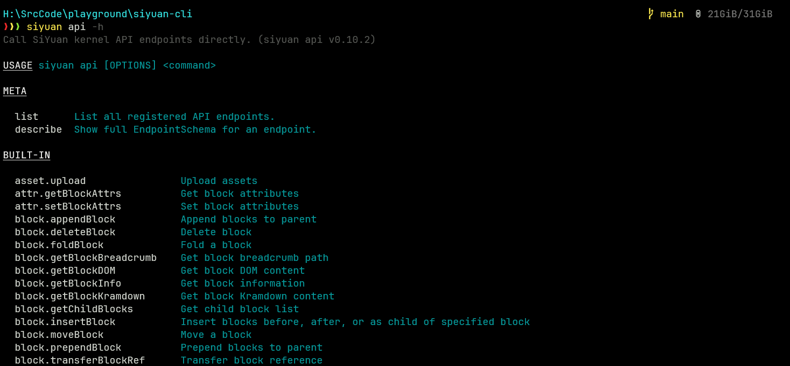
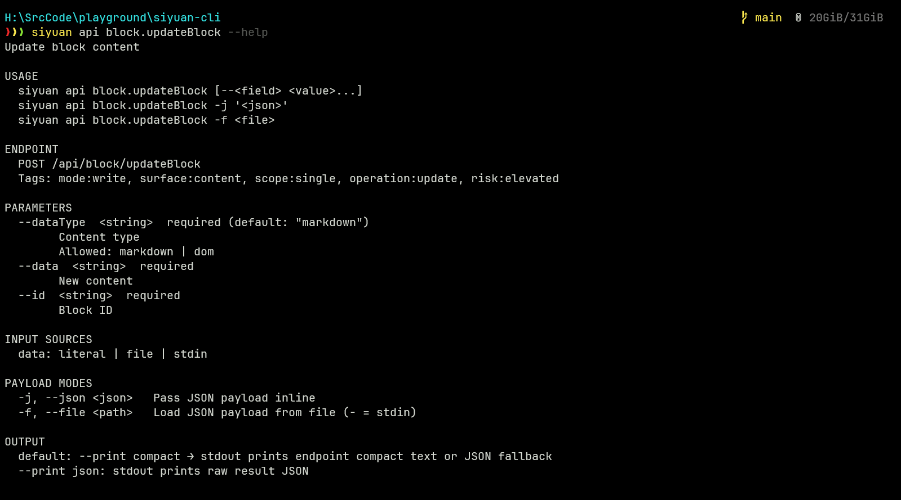
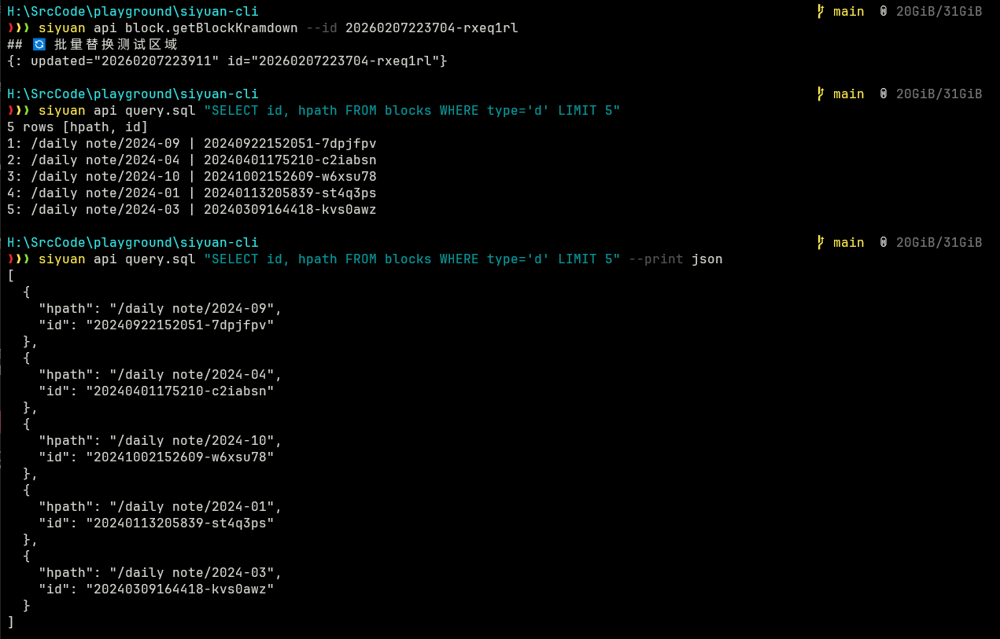
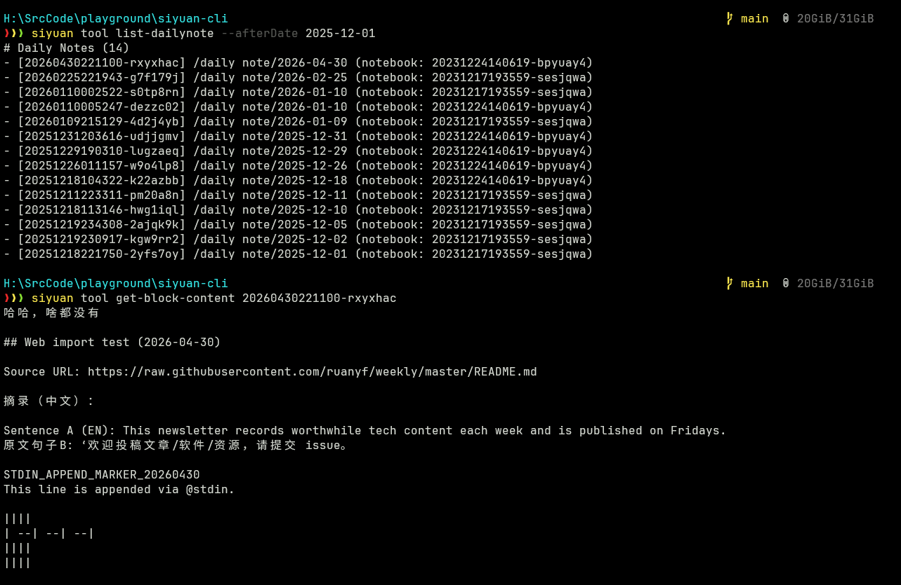
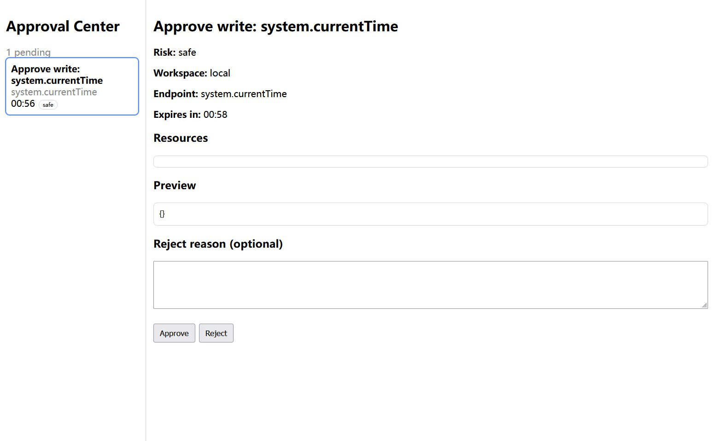

# siyuan-cli

A command-line interface that allows external agents (Claude Code, Codex, OpenCode, etc.) to operate [SiYuan Note](https://b3log.org/siyuan/) safely and effectively.

`siyuan-cli` is essentially a wrapper that calls the SiYuan HTTP kernel API for local agents. It complements what those raw HTTP calls lack: connection management, access control, and self-documentation required by agentic workflows.
It is designed for agents such as OpenCode, Claude Code, Codex, and Pi Coding Agent, which can run shell commands, inspect stdout/stderr, and read files.

> **Beta** · Node.js ≥ 20 · [GPL-3.0](LICENSE)

---

## Quick Start

### 1. Install

```bash
# npm
npm install -g @frostime/siyuan-cli

# pnpm
pnpm add -g @frostime/siyuan-cli
```

Requires **Node.js ≥ 20**.

### 2. Connect a SiYuan workspace

```bash
siyuan workspace add local --url http://127.0.0.1:6806 --token <your-token>  # Settings → About in SiYuan
siyuan workspace verify local
siyuan workspace which
```

If you don't know the port, use workspace directory auto-discovery (local only):

```bash
siyuan workspace add devspace --workspace-dir /path/to/SiYuanDevSpace --token <token>
```

### 3. Test the connection

```bash
siyuan api query.sql "SELECT id, hpath FROM blocks WHERE type='d' LIMIT 5"
```

Output (compact format, default):

```
5 rows [hpath, id]
1: /Restructure misc model provider | 20251111144823-0lhpmav
2: /Agent experiment design | 20260305172423-yswy868
3: /Prompt | Optimize notebook content | 20260124162935-qf9u737
...
```

### 4. Install the agent SKILL

```bash
siyuan skill install
```

By default, it installs the built-in SKILL to `~/.agents/skills/`.

Use `--target` to specify a different location, for example: `siyuan skill install --target claude`.

If you update `siyuan-cli`, run the command again to update the skill.

### 5. Use it in your agent

Launch an agent that can read skill files, read local files, and run shell commands.

Say to your agent:

> "Help me use siyuan-cli. Read the installed `siyuan-cli` SKILL, then use `siyuan doc list` for built-in docs when needed."

The README is a human-facing overview. Detailed operational guidance lives in the installed SKILL and built-in docs exposed by `siyuan doc list`.

## How to think about siyuan-cli

`siyuan-cli` is a **substrate** for agents: it provides reliable access to SiYuan through workspace resolution, permission checks, approval, response filtering, and built-in docs. It is not meant to encode every personal workflow.

For repeated workflows such as literature ingestion, daily review, project knowledge-base maintenance, or publication cleanup, create a task-specific Agent SKILL on top of this CLI. Use TypeScript extensions when you need reusable CLI runtime code; use downstream skills when you need reusable workflow policy.

---

## Calling Kernel APIs

Every registered SiYuan endpoint becomes a subcommand under `siyuan api`. The endpoint id format is `<group>.<name>`, derived from the kernel path `/api/<group>/<name>`.

```bash
# List all endpoints, optionally filter by group or tag
siyuan api --help
siyuan api list --group block

# View parameter schema and usage examples
siyuan api block.updateBlock --help
```




### Invocation styles

```bash
# Positional primary field (the first required string parameter)
siyuan api query.sql "SELECT id, hpath FROM blocks WHERE type='d' LIMIT 5"

# Named flags
siyuan api block.getBlockKramdown --id 20260425162235-pnpy21c

# Entire payload as inline JSON
siyuan api block.updateBlock -j '{"id":"...","data":"## New heading","dataType":"markdown"}'

# Entire payload from a JSON file (useful for complex payloads)
siyuan api block.updateBlock -f payload.json

# Payload from stdin
cat payload.json | siyuan api block.updateBlock -f -
```


### Flexible input sources

Some string fields accept content from external sources, so you don't have to inline large markdown or SQL into shell arguments. Which fields support which sources is declared per endpoint — check `<endpoint> --help` for the **INPUT SOURCES** section.

| Syntax | Meaning |
|--------|---------|
| `"plain text"` | Literal value (always available) |
| `@file:./path` | Read content from a file, resolved from cwd |
| `@stdin` | Read from stdin (single-use per invocation) |
| `@env:VAR_NAME` | Read from an environment variable |
| `@@file:...` | Escape — pass the literal string `@file:...` |

This is particularly useful for write operations where the content is long or contains characters that are awkward to escape in shell:

```bash
# Write a markdown file's content into a block
siyuan api block.updateBlock --id <id> --data @file:./content.md --dataType markdown

# Pipe SQL from another command
echo "SELECT id FROM blocks WHERE type='d' LIMIT 3" | siyuan api query.sql @stdin

# Read token from environment at runtime
siyuan workspace add ci --url http://ci-host:6806 --token @env:SIYUAN_TOKEN
```

For agents, `@file:` is especially valuable — the agent can write content to a temp file first, then pass it to the CLI, avoiding shell escaping issues entirely.

### Output and debugging

```bash
# Default: compact human-readable output (when the endpoint defines a formatter)
siyuan api query.sql "SELECT id, hpath FROM blocks LIMIT 5"

# Raw JSON from the kernel
siyuan api query.sql "SELECT id, hpath FROM blocks LIMIT 5" --print json

# Preview a write operation without sending it to the kernel
siyuan api block.deleteBlock --id <id> --dry-run

# Print the equivalent curl command to stderr
siyuan api block.updateBlock --id <id> --data "new text" --debug
```

Dry-run output includes a `wouldRequestApproval` field, telling you whether the current permission config would trigger the Approval Center for this operation.

---

## High-Level Tools

Many real tasks require multiple API calls. For example, "append content to today's daily note" involves creating the daily note if it doesn't exist, resolving its id, then calling the append API. Tools wrap these multi-step workflows into single commands.

```bash
# Append to today's daily note (auto-creates if needed, resolves id internally)
siyuan tool append-content \
  --targetId <notebook-id> --targetType dailynote \
  --markdown "## Today's notes\nNew content here"

# Append from a file
siyuan tool append-content \
  --targetId <doc-id> --targetType document \
  --markdown @file:./notes.md

# Document tree listing
siyuan tool list-doc-tree --entry <notebook-id> --depth 2
```

```
# Document tree: daily note
- 2026 (20260319110807-rpatefx)
  ├─ 03 (20260319110808-qvgecjr) (+3)
  └─ 04 (20260425162235-bxpakql) (+2)
```

```bash
# Daily notes by date range
siyuan tool list-dailynote --afterDate 2026-04-01

# Read document content with pagination
siyuan tool get-block-content <doc-id> --slice "0:30" --showId true
# Continue from where you left off
siyuan tool get-block-content <doc-id> --slice "<last-block-id>:+20"

# Block metadata inspection (includes TOC for document blocks)
siyuan tool get-block-info <block-id>

# Path resolution — translate human-readable paths to stable ids
siyuan tool resolve-path --hpath "/private/diary"
```

All tools support `--dry-run`, `--help`, and `--print json`. Run `siyuan tool list` for the full list.



---

## Workspace Management

### Global configuration

Workspace connections are stored in `~/.config/siyuan-cli/config.yaml` (also respects `$XDG_CONFIG_HOME` and `$SIYUAN_CLI_CONFIG`), created automatically by `workspace add`.

```bash
siyuan workspace add local  --url http://127.0.0.1:6806 --token <token>
siyuan workspace add remote --url http://192.168.1.100:6806 --token <token>
siyuan workspace use local          # set global default
siyuan workspace list               # list all configured workspaces
siyuan workspace verify local       # test connection and auth
```

Tokens can be stored literally or sourced from environment variables at runtime:

```yaml
workspaces:
  prod:
    baseUrl: http://192.168.1.100:6806
    tokenSource:
      type: env
      value: SIYUAN_TOKEN       # resolved at call time, never written to config
```

### Project-level pinning

When multiple projects talk to different SiYuan instances, a global default causes conflicts. Place a `.siyuan-cli.yaml` at your project root to pin that project to a workspace:

```yaml
# .siyuan-cli.yaml — safe to commit (the CLI hard-errors if you put tokens or URLs here)
schemaVersion: 1
workspace: prod   # must exist in the global config
```

The full resolution chain:

```
--workspace flag  →  $SIYUAN_CLI_WORKSPACE  →  .siyuan-cli.yaml  →  config.current
```

Use `siyuan workspace which` at any time to inspect how the current directory resolves — it shows the resolved workspace, its source, the base URL, whether a token is present, and the full permission rule list.

---

## Permission & Guard System

Letting an agent freely operate on your personal notes is risky. SiYuan's kernel API includes endpoints that delete documents, close notebooks, or even shut down the kernel. The CLI enforces access control at two levels: **request interception** before requests reach the kernel, and **response filtering** that strips restricted items from query results.

### Permission rules

Rules are declared per workspace (or per project in `.siyuan-cli.yaml`) and evaluated top-to-bottom — first match wins:

```yaml
permission:
  default: allow
  rules:
    # Hard-block kernel shutdown
    - endpoint: "system.exit"
      effect: deny

    # Destructive system operations require human approval
    - endpoint: "system.*"
      effect: approval

    # Deny all access to a private notebook
    - notebook: "20220305173526-4yjl33h"
      effect: deny

    # Block writes to a specific document subtree
    - path: "/20260107143325-zbrtqup/**"
      action: write
      effect: deny

    # Block a specific document by id (equivalent to path: "**/20260107143325-zbrtqup.sy")
    - root_id: "20260107143325-zbrtqup"
      effect: deny
```

Rules match on `endpoint`/`tool`/`action` (evaluated immediately from the request) and on `notebook`/`path` (resolved from block ids in the payload). Three effects: **deny** (hard block, exit code 5), **allow** (pass through), **approval** (pause for human sign-off).

### What it looks like in practice

**Blocked endpoint** — `system.exit` is hard-denied:

```
$ siyuan api system.exit

{"error":"ENDPOINT_DENIED","message":"endpoint \"system.exit\" denied: denied by rule #0"}
exit code: 5
```

**Accessing a doc in a denied notebook** — the CLI resolves the block's owning notebook before sending the request:

```
$ siyuan api block.getBlockKramdown --id 20240416110608-8pr45e1

{"error":"CONTENT_DENIED","message":"id \"20240416110608-8pr45e1\" (access: read) denied by rule #3"}
exit code: 5
```

**Response filtering** — query results from denied notebooks are automatically stripped. Here, one notebook is denied; `lsNotebooks` drops it and reports what was removed:

```
$ siyuan api notebook.lsNotebooks

{"warning":"CONTENT_FILTERED","removed":1,"reasons":"1x: rule #3"}
10 notebooks [id, name, ...]
1: 20231217193559-sesjqwa | Inbox | ...
2: 20220306104547-c7ilt3x | Academic Learn | ...
...
```

The same applies to SQL queries — rows from restricted notebooks are filtered before reaching stdout:

```
$ siyuan api query.sql "SELECT id, hpath, box FROM blocks WHERE type='d' LIMIT 10"

{"warning":"CONTENT_FILTERED","removed":5,"reasons":"5x: rule #3"}
5 rows [box, hpath, id]
1: 20231217193559-sesjqwa | /daily note | ...
...
```

**Approval flow** — when a rule sets `approval` (or the operation is auto-classified as destructive), the CLI starts a local broker and opens a WebUI for human sign-off:

```
$ siyuan api system.getConf

{"event":"APPROVAL_PENDING","requestId":"apr_f0f32b2a8bbd492d","url":"http://127.0.0.1:1548/approval?token=...","summary":"Approve: system.getConf"}
```



```bash
siyuan approval list             # pending and recent requests
siyuan approval approve <id>     # approve from terminal
siyuan approval reject <id>      # reject from terminal
```

Independent of user-configured rules, endpoints classified as `destructive` or `critical` risk — batch deletes, system-level writes, runtime invocations — **automatically require approval even if your rules say `allow`**. This is a built-in safety net that cannot be bypassed by permission rules alone; only `--yes` (or `behavior.allowYes: false` to disable `--yes` entirely) controls it.

Use `siyuan workspace which` to inspect the resolved rule list, or `--dry-run` on any command to preview whether it would be blocked or gated. For the complete rule reference: `siyuan doc read permission`.

---

## Context Control & Built-in Docs

`siyuan-cli` does not push a large tool catalog or document corpus into the agent context upfront.

Agents discover capabilities incrementally:

- `siyuan --help` for the command tree;
- `siyuan api list` for endpoints;
- `siyuan api <id> --help` for one endpoint;
- `siyuan doc list` and `siyuan doc read <topic>` for deeper docs;
- `siyuan tool list` for higher-level workflows.

This keeps context disclosure **explicit, local, and task-driven**.

These docs are designed for agent consumption — agents read them at runtime via CLI commands or direct file access. Human users generally don't need to read them directly; the SKILL and `--help` output cover day-to-day guidance.

### Doc organization

The built-in doc set is organized in three layers:

| Layer | Path | Covers |
|-------|------|--------|
| SiYuan domain knowledge | `siyuan-guide/` | Block data model, path semantics (id vs hpath), SQL query strategy, daily note model |
| CLI usage reference | `cli-usage/` | Full command tree, global flags, input sources, permission config, extension authoring, error codes |
| Task recipes | `recipes/` | Step-by-step workflows: connect workspace, find documents, read content, safely edit content |

```bash
siyuan doc list                          # list all docs with file paths and summaries
siyuan doc read README.md                # read a doc by path or unique name
siyuan doc read recipes/edit-content.md  # task-oriented operation recipes
```

The docs root path is printed by `siyuan --help`, so agents with file system access can read files directly without going through the CLI.

---

## Building Task-Specific Skills

`siyuan-cli` is the **substrate** — it gives agents the ability to discover and call the CLI. Real workflows should be built as separate task-specific skills on top of it, e.g.:

- literature note ingestion
- daily note review
- project knowledge-base maintenance
- refactoring tags and attributes
- exporting documents for publication
- syncing issue trackers into SiYuan

Install the skill:

```bash
siyuan skill install                       # default: ~/.agents/skills/
siyuan skill install --target claude       # → ~/.claude/skills/
siyuan skill install --target .copilot --local  # → ./.copilot/skills/ (project-local)
```

Tip: install `skill-creator`, then ask your agent:

> I want to xxxx, please create a skill based on `siyuan-cli`

---

## User Extensions

`siyuan-cli` only wraps a subset of SiYuan's kernel API — the most commonly needed endpoints. The kernel exposes [many more](https://github.com/siyuan-note/siyuan/blob/master/kernel/api/router.go), and you may also want to compose multiple API calls into reusable workflows. Extensions let you add both without touching the source code.

Extensions live in `~/.config/siyuan-cli/extensions/` and are written in TypeScript, loaded via `jiti` at execution time:

```bash
siyuan extension init          # scaffold the directory with tsconfig.json and examples
siyuan extension list          # show discovered extensions + cache status
siyuan extension cache         # batch-generate schema.json caches
```

> **Tip**: You can tell your agent:
> "I want to extend the siyuan-cli API. Please read the siyuan-cli docs and help me write an extension for `<endpoint>`."
> The agent can read `siyuan doc read cli-usage/extension`, visit the website (if it is capable), and generate the extension file for you.
>
> **Reference**
>
> 1. [Source Code](https://github.com/siyuan-note/siyuan/blob/master/kernel/api/router.go) — Most reliable, but needs agent analyse code by it self
> 2. Document provided by community, could be out-dated
>   - `https://leolee9086.github.io/siyuan-kernelApi-docs/`, provided by leolee9086
>   - `https://leolee9086.github.io/siyuan-kernelApi-docs/index.html`, provided by leolee9086
>   - `https://github.com/siyuan-community/siyuan-sdk/tree/main/schemas/kernel/api`, provided by Zuoqiu-Yingyi


### API extension example

The kernel has a `/api/lute/copyStdMarkdown` endpoint that exports a block's content as standard Markdown — useful when you need clean Markdown instead of SiYuan's internal Kramdown. This endpoint is not built into the CLI, but you can add it in three steps.

**Step 1** — Create `~/.config/siyuan-cli/extensions/apis/copyStdMarkdown.ts`:

```ts
import type { EndpointSchema } from "@frostime/siyuan-cli/schema";

export const schema: EndpointSchema = {
  endpoint: "/api/lute/copyStdMarkdown",
  summary: "Get standard Markdown content of a block",
  payload: {
    type: "object",
    properties: {
      id: { type: "string", description: "Block ID" },
    },
    required: ["id"],
  },
  classification: { mode: "read", surface: "content", scope: "single" },
};
```

**Step 2** — Cache and verify:

```bash
siyuan extension cache
siyuan api lute.copyStdMarkdown --help
```

**Step 3** — Use it:

```bash
siyuan api lute.copyStdMarkdown --id 20240401175210-c2iabsn
```

The extension gets the same CLI surface as built-ins: `--help`, `--dry-run`, `--print json`, parameter validation, and permission checks.

### Custom tool example

Create `~/.config/siyuan-cli/extensions/tools/hello.ts`:

```ts
import type { ToolSchema } from "@frostime/siyuan-cli/schema";

export const tool: ToolSchema = {
  id: "hello-ext",
  summary: "Greet someone",
  input: {
    type: "object",
    properties: { name: { type: "string", description: "Name to greet" } }
  },
  async run(_ctx, input) {
    const { name = "world" } = input as { name?: string };
    return { content: `Hello, ${name}!` };
  }
};
```

```bash
siyuan extension cache
siyuan tool hello-ext --name Alice
```

Tool extensions receive a `ToolContext` with `callEndpoint()` for calling registered endpoints (with full permission and guard logic) and `callEndpointRaw()` for calling arbitrary kernel paths directly.

For the full authoring guide: `siyuan doc read cli-usage/extension`.

---

## Troubleshooting

### Windows Git Bash / MSYS

Arguments starting with `/` may be rewritten into Windows paths by the shell before reaching the CLI. This affects SiYuan virtual paths like `--hpath "/TestDoc"`. Two workarounds:

```bash
# Disable path conversion for this command
MSYS_NO_PATHCONV=1 siyuan tool resolve-path --hpath "/TestDoc"

# Or use double-slash as a Git Bash / MSYS escape
siyuan tool resolve-path --hpath //TestDoc
```

### Auth failures

- Verify the token with `siyuan workspace verify <name>`
- Check that SiYuan's kernel is running and reachable at the configured URL
- Tokens from `tokenSource: env` are resolved at call time; ensure the env var is set in the calling shell

### Wrong workspace

Run `siyuan workspace which` to inspect the resolved workspace and its resolution source. Use `--workspace <name>` to override for a single command.

### Permission denied

- Run `siyuan api <id> --dry-run` to see if the operation would be blocked
- Run `siyuan workspace which` to review the full rule list
- Edit the `siyuan-cli/config.yaml` file

---

## License

[GPL-3.0](LICENSE) · GitHub: https://github.com/frostime/siyuan-cli
